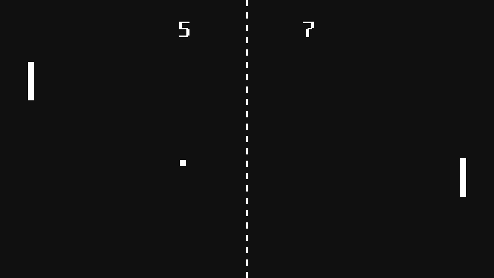

# 퐁 (고도 엔진)

<b>[한국어](README.md)</b> | [English](README.en.md)

[Godot Engine 3.4.2 Mono](https://godotengine.org/)로 구현한 [퐁](https://ko.wikipedia.org/wiki/%ED%90%81) 게임입니다.

## 게임하기

| 사진을 클릭해 내려받기 |
|:---:|
|  |

### 조작법
| 조작법 | 키보드 | 컨트롤러 |
|:---:|:---:|:---:|
| 움직이기 | 플레이어 1: `[W][S]` 플레이어 2: `[I][K]` | 스틱, D-패드 |
| 선택 | `[Enter]` |   |
| 일시정지 | `[Esc]` | `[Back][Select]` |
| 전체화면 | `[F11]` | `[Start]` |

### 팁
- 공의 속도는...
  - 벽에 부딪힐 때마다 1%씩 증가하며,
  - 라켓에 부딪힐 때마다 5%씩 증가합니다.
- 라켓의 가장자리로 공을 치려고 노력해보세요!
- 점수가 높을수록 인공지능도 빨라집니다.

## 빌드하기
이 git은 clone할 시 엔진 안에서 새 프로젝트로 들일 수 있습니다. 
그 뒤 [공식 내보내기 안내](https://docs.godotengine.org/ko/stable/tutorials/export/exporting_basics.html)를 따라하시면 됩니다.
