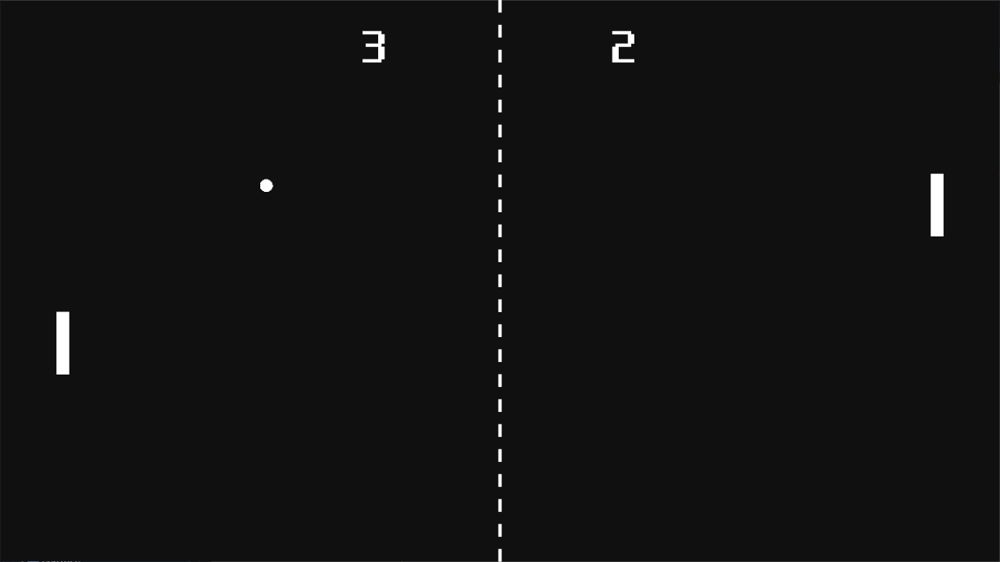

# 퐁 (고도 엔진)

[한국어](README.md) | [English](README.en.md)

[Godot Engine 3.4.2 Mono](https://godotengine.org/)로 구현한 [퐁](https://ko.wikipedia.org/wiki/%ED%90%81) 게임입니다.

## 조작법

\[&#8593;]\[&#8595;]: 라켓 움직이기 
\[Space]: 점수 초기화 후 다시 시작 
\[ESC]: 게임 종료

## 빌드하기
이 git은 clone할 시 엔진 안에서 새 프로젝트로 들일 수 있습니다. 
그 뒤 [공식 내보내기 안내](https://docs.godotengine.org/ko/stable/tutorials/export/exporting_basics.html)를 따라하시면 됩니다.
