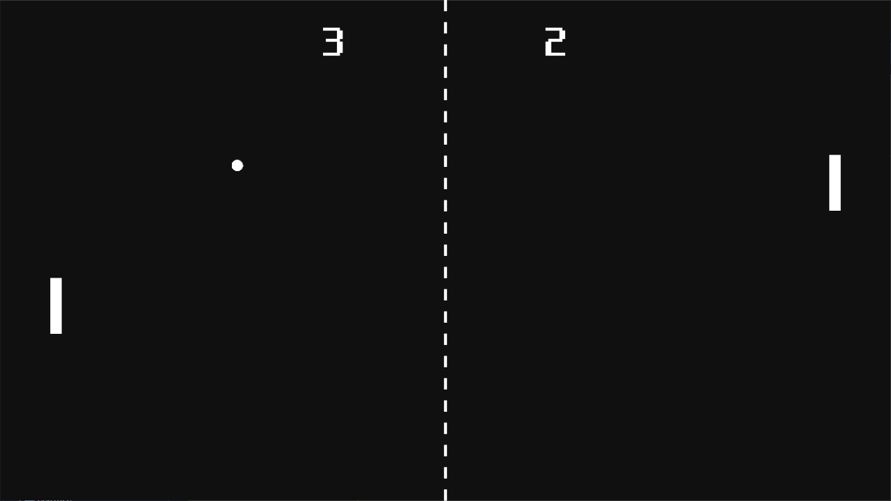

# 퐁 (고도 엔진)

<b>[한국어](README.md)</b> | [English](README.en.md)

[Godot Engine 3.4.2 Mono](https://godotengine.org/)로 구현한 [퐁](https://ko.wikipedia.org/wiki/%ED%90%81) 게임입니다.

## 게임하기

[내려받기](https://github.com/HaneulCheong/godot-pong/releases/latest)

### 조작법
- \[&#8593;]\[&#8595;]: 라켓 움직이기
- \[P]: 일시정지 및 해제
- \[Space]: 점수 초기화 후 다시 시작
- \[F11]: 전체화면 모드 켜기/끄기
- \[ESC]: 게임 종료

### 팁
- 공의 속도는...
  - 벽에 부딪힐 때마다 1%씩 증가하며,
  - 라켓에 부딪힐 때마다 5%씩 증가합니다.
- 라켓의 가장자리로 공을 치려고 노력해보세요!
- 점수가 높을수록 상대방도 빨라짐을 주의하세요.

## 빌드하기
이 git은 clone할 시 엔진 안에서 새 프로젝트로 들일 수 있습니다. 
그 뒤 [공식 내보내기 안내](https://docs.godotengine.org/ko/stable/tutorials/export/exporting_basics.html)를 따라하시면 됩니다.
